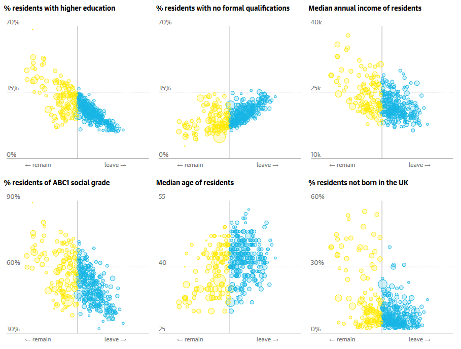

```{r setup, include=FALSE}
knitr::opts_chunk$set(echo = TRUE)
```

## Introduction

We will investigate if different features of each local authority, such as the median income or age of all residents, influenced the results of the UK national referendum to decide whether the country should leave the European Union (EU) or not. Therefore, if somehow the results could have been predicted.

During this report we perform two different approaches: logistic regression and decision tree. Both are compared in order to select which is the best option for the Brexit data.

Firstly, we must load the libraries needed and read the csv file with the Brexit data obtained from the Guardian’s plots (The Guardian, 2017) and we show the first 5 rows.

```{r libraries, warning = FALSE, message = FALSE}
library(ggplot2)
library(tidyverse)
library(caret)
library(knitr)
require(gridExtra)
library(dplyr)
library(ggpubr)
library(reshape2)
library(rpart)
library(rpart.plot)
```

```{r brexit}
brexit = read_csv("BrexitVotingData.csv")

brexit[1:5, ] %>%
  kable(caption = "First five rows of Brexit data")

n = nrow(brexit)
print(n)
```

The data consists of 344 records, one for each local authority, and 6 attributes:

- abc1: proportion of individuals who are in the ABC1 social classes (middle to upper class)
- medianIncome: median income of residents.
- medianAge: median age of residents.
- withHigherEd: proportion of residents with any university-level education.
- notBornUK: the proportion of residents who were born outside the UK.
- voteBrexit: did more than 50% of people vote to Leave?

All variables except voteBrexit, which is True or False, are normalised for an easier analysis they will be used for predicting the possible outcome of the referendum. Therefore, they contain values from 0 to 1 where zero is the lowest value and one the highest value. 

We also check if the data contain any missing value and do research if the data is right.

```{r}
numberNaN = sum(apply(brexit,2,is.nan))
print(numberNaN)
```

As we can see, there are no missing values; however, the number of records in our data (344) does not match with the expected one from the Guardian’s data (382). This difference can be caused by the method used to scrape the website data. Furthermore, an additional attribute referencing the name of the local authority would be useful for a better analysis.

Additionally, we show a plot for each possible input variable for guessing the outcome of the referendum in order to give an overview. Using the same colours as in the Guardian’s graphs, yellow for remaining and blue for leaving the EU, we split each attribute by ranges of 0.2 and show the percentage of remaining against leaving the EU.

```{r warning = FALSE, message = FALSE}
brks <- c(0, 0.25, 0.5, 0.75, 1)
ranges = seq(from = 0, to = 1, by = 0.1)
theme = theme_minimal() + theme(axis.text.x = element_text(size = 5, angle = 90, hjust = 0.7))

abc1 = data.frame(
  range = vector(length = length(ranges) - 1),
  brexit_f = vector(length = length(ranges) - 1),
  brexit_t = vector(length = length(ranges) - 1)
)
for (i in 1:(length(ranges)- 1)) {abc1[i, 1] = paste(ranges[i], ranges[i+1], sep = "-")}
notBornUK = abc1
medianIncome= abc1
medianAge = abc1
withHigherEd = abc1

for (i in 1:(length(ranges) - 1)) {
  tmp = brexit %>% filter(ranges[i] <= abc1 & abc1 <= ranges[i+1])
  abc1$brexit_t[i] = sum(tmp$voteBrexit)
  abc1$brexit_f[i] = nrow(tmp) - abc1$brexit_t[i]
  tmp = brexit %>% filter(ranges[i] <= notBornUK & notBornUK <= ranges[i+1])
  notBornUK$brexit_t[i] = sum(tmp$voteBrexit)
  notBornUK$brexit_f[i] = nrow(tmp) - notBornUK$brexit_t[i]
  tmp = brexit %>% filter(ranges[i] <= medianIncome & medianIncome <= ranges[i+1])
  medianIncome$brexit_t[i] = sum(tmp$voteBrexit)
  medianIncome$brexit_f[i] = nrow(tmp) - medianIncome$brexit_t[i]
  tmp = brexit %>% filter(ranges[i] <= medianAge & medianAge <= ranges[i+1])
  medianAge$brexit_t[i] = sum(tmp$voteBrexit)
  medianAge$brexit_f[i] = nrow(tmp) - medianAge$brexit_t[i]
  tmp = brexit %>% filter(ranges[i] <= withHigherEd & withHigherEd <= ranges[i+1])
  withHigherEd$brexit_t[i] = sum(tmp$voteBrexit)
  withHigherEd$brexit_f[i] = nrow(tmp) - withHigherEd$brexit_t[i]
}

df.long<-melt(abc1)
q1 = ggplot(data = df.long, aes(range, value, fill = variable)) +
  geom_bar(stat = "identity", position = "fill", show.legend = FALSE) + 
  xlab("Normalised range") + ylab("Percent") + labs(caption = "ABC1.") +
  scale_y_continuous(breaks = brks, labels = scales::percent(brks)) +
  scale_fill_manual(values=c('#ffea00','#16b5e5')) + theme

df.long<-melt(notBornUK)
q2 = ggplot(data = df.long, aes(range, value, fill = variable)) +
  geom_bar(stat = "identity", position = "fill", show.legend = FALSE) + 
  xlab("Normalised range") + ylab("Percent") + labs(caption = "Not born in UK.") +
  scale_y_continuous(breaks = brks, labels = scales::percent(brks)) +
  scale_fill_manual(values=c('#ffea00','#16b5e5')) + theme

df.long<-melt(medianIncome)
q3 = ggplot(data = df.long, aes(range, value, fill = variable)) +
  geom_bar(stat = "identity", position = "fill", show.legend = FALSE) + 
  xlab("Normalised range") + ylab("Percent") + labs(caption = "Median income.") +
  scale_y_continuous(breaks = brks, labels = scales::percent(brks)) +
  scale_fill_manual(values=c('#ffea00','#16b5e5')) + theme

df.long<-melt(medianAge)
q4 = ggplot(data = df.long, aes(range, value, fill = variable)) +
  geom_bar(stat = "identity", position = "fill", show.legend = FALSE) + 
  xlab("Normalised range") + ylab("Percent") + labs(caption = "Median age.") +
  scale_y_continuous(breaks = brks, labels = scales::percent(brks)) +
  scale_fill_manual(values=c('#ffea00','#16b5e5')) + theme

df.long<-melt(withHigherEd)
q5 = ggplot(data = df.long, aes(range, value, fill = variable)) +
  geom_bar(stat = "identity", position = "fill") + 
  xlab("Normalised range") + ylab("Percent") + labs(fill = "Referendum", 
                                                    caption = "With higher education.") +
  scale_y_continuous(breaks = brks, labels = scales::percent(brks)) +
  scale_fill_manual(labels=c("Remain", "Leave"), values=c('#ffea00','#16b5e5')) + 
  theme
leg <- get_legend(q5)
q5 = q5 + theme(legend.position = "none")

grid.arrange(q1, q2, q3, q4, q5, as_ggplot(leg), ncol = 2, nrow = 3)
```

Overall, we can see two types of trend, the ones in which the outcome of the referendum is converted from “Leave” to “Remain” while the normalised value increase and the ones with the opposite behaviour. The first case includes *social grade*, *not born in UK*, *median income* and *higher education*; conversely, there is only one attribute following the opposite trend, *median age*. Furthermore, these trends are generally followed but some intermediate ranges are affected by outliers making them not follow the trend. 

\newpage
## Task 1: Logistic Regression

**Definition**: A logistic regression is a classification method used for modelling the probability that an output belongs to one of two possible classes.

In our scenario, the two possible outcomes are “Leave” or “Remain”.

#### 1.1. Fit a logistic regression models using all of the available inputs. Identify the direction of each effect from the fitted coefficients. Compare these with the plots shown on the Guardian website. Do they agree?\

We use the **glm** and **summary** commands to perform the logistic regression and get the model coefficients, respectively. We use the same command for creating the model as we would use for linear regression; however, we must specify that we use logistic regression setting the parameter *family* to binomial because the likelihood takes the form of a binomial probability. The other parameters are the dataset to use, Brexit data, and the formula specifying the inputs and outputs:
$$voteBrexit \sim abc1 + notBornUK + medianIncome + medianAge + withHigherEd$$
```{r}
formula = "voteBrexit ~ abc1 + notBornUK + medianIncome + medianAge + withHigherEd"
vote_model = glm(formula = formula, family = binomial, data = brexit)
summary_vote = summary(vote_model)
format(summary_vote$coefficients, digits = 5) %>%
  kable(caption = "Coefficients of the regression model.")
```

We can see from the previous table negative and positive estimate coefficients, which represents the change for each unit in the predictor while other predictors are held constant. From the definition, we can imagine that positive coefficients make the event more likely while negative ones make it less likely. In other words, a positive estimate coefficient influences more to the outcome "Leave" and a negative estimate coefficient influences the outcome "Remain".

For checking this assumption, we use the input with the highest absolute estimate coefficient, *withHigherEd* (`r format(summary_vote$coefficients[6, 1], digits = 5)`) and the graph introduced for this input in the Introduction section. As the coefficient is negative, the percentage of the outcome "Leave" should decreases when the level of education increases and the bar plot from the Introduction follows this pattern. 

The directions for each input are the following:

```{r}
df <- data.frame(
  Input = c("abc1", "notBornUK", "medianIncome", "medianAge", "withHigherEd"),
  Direction = c("Leave", "Leave", "Remain", "Leave", "Remain")
)
kable(df, caption = "Direction of each input.")
```

The Guardian newspaper presented the different plots. They sepparated the data in six attributes of which the only one that we do not use is the proportion of residents with no formal qualifications. All plots follow the same structure, the x-axis represents the result of the referendum in percentage and the y-axis the proportion in percentage of the attribute.  



The directions for the variables with *higher education*, *median income* and *median age* agree with the plots on the Guardian's website. For the variable higher education, we expect a clear preference to remain when the education level is higher, and this requirement is met. For the median income and median age, as their estimate coefficients are lower than the one from higher education, we expect to see scattered plots with slight preference for remaining and leaving, respectively, when their input increases.

On the other hand, the input variables *ABC1 social grade* and *not born in the UK* disagree with the Guardian's plots. For the ABC1 social grade, we would expect to see a clear relation with leaving the EU; however, from the plot, we see that when the resident’s percentage of ABC1 social grade is over 60%, they marginally decided to remain. For the residents not born in UK, the plot would have to be scattered and lightly moved to leaving outcome, but the plot contains mainly remaining outcomes when the non-UK residents is over 30%. A possible reason  causing this discrepancy may be the existence of several clusters that make good reading more difficult.
 
#### 1.2. Present the value of each coefficient estimate with a 95% confidence interval. Which input would you say has the strongest effect?\

In order to answer this question, we have to look at the uncertainty, as specified by the confidence intervals, in our coefficient estimates. We will also use the coefficient standard error from the summary of the previous section. 

In logistic regression, the standard errors are approximated by assuming that the distribution of the likelihood is normal. Therefore, the confidence intervals are approximate and they have a lower precision than if we use linear regression as they are exact. To be able to calculate confidence intervals we need to do the assumption that the data is large which is possible as our dataset has `r n` records.

To calculate the approximate 95\% confidence interval, we need the value of $z_{critical}$ for which $P(z > z_{critical}) = 0.975$:

```{r}
z_critical = qnorm(p=0.975)
```

This is very close to 1.96, as our sample size is large enough. Our confidence interval is defined as:
$$\textrm{C.I.: Estimate} \pm z_{critical} \times \textrm{Standard Error}$$
Hence we can calculate a C.I. as below for each input variable, using vectors of the low and high points. Afterwards, the confidence intervals are shown together.

```{r}
CI_acb1 = summary_vote$coefficients[2, 1] + c(-1,1) * z_critical * 
  summary_vote$coefficients[2, 2]
CI_notBornUK = summary_vote$coefficients[3, 1] + c(-1,1) * z_critical * 
  summary_vote$coefficients[3, 2]
CI_medianIncome = summary_vote$coefficients[4, 1] + c(-1,1) * z_critical * 
  summary_vote$coefficients[4, 2]
CI_medianAge = summary_vote$coefficients[5, 1] + c(-1,1) * z_critical * 
  summary_vote$coefficients[5, 2]
CI_withHigherEd = summary_vote$coefficients[6, 1] + c(-1,1) * z_critical * 
  summary_vote$coefficients[6, 2]

estimate 	= c(mean(CI_withHigherEd), mean(CI_medianAge), mean(CI_medianIncome), 
              mean(CI_notBornUK), mean(CI_acb1))
upper  	= c(CI_withHigherEd[2], CI_medianAge[2], CI_medianIncome[2], 
            CI_notBornUK[2], CI_acb1[2])
lower  	= c(CI_withHigherEd[1], CI_medianAge[1], CI_medianIncome[1], 
            CI_notBornUK[1], CI_acb1[1])

verticalpos = seq(from = 0.5, by = 0.5, length.out = 5)
par(oma=c(1,1,1,1), mar=c(6,6,1,6))
plot(x=1, y=0, type="n",  ann=F, xaxt='n', 
     xlim=c(-40, 40) , 
     ylim=c(0,3), yaxt='n', xlab = "", ylab= NULL, bty="n")

for(i in c(-40, -20, 20, 40)){
  lines(c(i, i), c(0, 5), lty = 2, lwd=1, col="gray53") 
}
points(estimate, verticalpos , cex=1.2, pch=16)
for(i in 1:5 ){
  lines(c(lower[i], upper[i]), c(verticalpos[i], verticalpos[i]), lwd=1.5)
  lines(c(lower[i], lower[i]), c(verticalpos[i] + 0.1, verticalpos[i] - 0.1), lwd=1.5)
  lines(c(upper[i], upper[i]), c(verticalpos[i] + 0.1, verticalpos[i] - 0.1), lwd=1.5)
}
axis(side = 1, cex.axis =1) 

mtext("Approximate 95% confidence intervals for each input variable.", side = 1, cex=1, line = 4) 
mtext(text = c(	"Higher Education", "Median Age", "Median Income", "Not Born in UK",
                "ABC1"), side = 2, line = 5, outer = FALSE, at = verticalpos , las=1, cex=1, adj=0)
mtext(text = paste( formatC(estimate), 
                    " (", 
                    formatC(lower), 
                    ", ", 
                    formatC(upper), 
                    ")", 
                    sep=""), 
      side = 4, line = 4, outer = FALSE, at = verticalpos , las=1, cex=1, adj=1)

abline(v = 0, col = "red", lty=2)
box("inner")
```

All approximate 95% confidence intervals are useful predicators for the Brexit outcome as none of them contain zero within their intervals. Being the variables *With Higher Education* and *ABC1* the most influent and the other inputs are still important but with less weight. Additionally, if we look at the summary in the Table 2, we can see that in all cases the p-value is below 0.05, so this reasserts that the input provides information about the output.

#### 1.3. Using aic, perform a model selection to determine which factors are useful to predict the result of the vote. Use a ‘greedy’ input selection procedure, as follows: 
* select the best model with 1 input;
* fixing that input, select the best two-input model (i.e. try all the other 4 inputs with the one you selected first); 
* select the best three-input model containing the first two inputs you chose, etc. At each stage evaluate the quality of fit using aic and stop if this gets worse.

As we introduced in the previous assignment, the Akaike Information Criterion (AIC) provides the quality of a model while penalises its complexity and it is useful when we compare different models. The smaller the AIC is, the better the model is. 

To perform the model selection, we create a function that compares the AIC of the all possible models remaining regarding the *input* parameter, creates a table to visualise all AIC and selects the best model. This process is repeated as many times as the input *depth* indicates. The different parameters are:

- Output: output variables of the formula.
- Input: input variables of the formula.
- Depth: number of input variables of the final model.
- Data: dataset to use.

```{r}
calculateInputs = function(output, input, depth, data) {
  for (input_length in 1:depth) {
    var_name = paste("table_", input_length, sep = "")
    df <- data.frame(
      Input = vector(length = length(input)),
      AIC = vector(length = length(input))
    )
    
    for (i in 1:length(input)) {
      if (input_length == 1) {
        formula = paste(output, "~", input[i])
      } else {
        formula = paste(output, " ~ ", best_input, " + ", input[i], sep = "")
      }
      
      tmp = glm(formula = formula, family = binomial, data = data)
      tmp = summary(tmp)
      df$Input[i] = sub(".*~ ", "", formula)
      df$AIC[i] = tmp$aic
    }
    
    assign(var_name, df, envir = .GlobalEnv)
    best_input = df$Input[which.min(df$AIC)]
    input = input[input != input[which.min(df$AIC)]]
  }
}
```

Once the function is created, we call it using the formula from the Section 1.1, the dataset *brexit* and a depth of 5 levels as indicated in the statement.

```{r}
output_variable = "voteBrexit"
input_variables = c("abc1", "notBornUK", "medianIncome", "medianAge", "withHigherEd")

calculateInputs(output_variable, input_variables, 5, brexit)
```

```{r}
kable(table_1, caption = "AIC comparison of one-input model.")
```

The model using the input variable *withHigherEd* obtained the best score (`r table_1[5,2]`), the other input variables scored significantly worse. This result was expected because the higher education variable is the one with the highest absolute estimate coefficient; therefore, it contains more important information.

```{r}
kable(table_2, caption = "AIC comparison of two-input model.")
```

The best two-input model is the best one-input model adding the variable *abc1* obtaining a score of `r table_2[1,2]`. Again, this improvement could be expected because this variable contains more information than the other variables remaining.

```{r}
kable(table_3, caption = "AIC comparison of three-input model.")
```

After using the two variables with more influence on the output. The last three inputs have estimate coefficients of similar magnitude, which means that all three contain a similar amount of information related to the output. Therefore, it is not possible to predict the best three input model, which, in this case, is adding the input *medianAge* (`r table_3[3,2]`).

```{r}
kable(table_4, caption = "AIC comparison of four-input model.")
```

The best four-input model is adding the *medianIncome* to the formula of the best three-input model scoring `r table_4[2,2]`.

```{r}
kable(table_5, caption = "AIC of five-input model.")
```

Finally, the best model with better AIC is the five-input model with a score of `r table_5[1,2]`.

After adding each new input, the reduction of the AIC has been smaller and smaller. The reason for this small improvement is that the input variables with more significant information are used in the first levels and the ones with less importance are used as last option; in addition, the AIC penalises each extra input variable with 2 extra points in the score.

\newpage
## Task 2: Decision Tree

**Definition**: A decision tree is a diagram that uses an ordered sequence of decision points, based on the data, to make a decision.

In our scenario, there are two possible outcomes are “Leave” or “Remain”.

#### 2.1. Use the rpart package to create a decision tree classification model. Visualise your model and intepret the fitted model.\

In order to create the decision tree, we use the **rpart** command, which has a similar way of work to the **glm** command used for regression models. We need to specify the dataset to use and the formula specifying the inputs and outputs, both are the same that we used for the logistic regression, we also specify the *method* parameter to class because our outcome is a factor. Furthermore, to obtain a better accuracy as well as to use all 5 input variables, we increase the complexity of the model setting *control* to 0.005.

```{r}
formula = "voteBrexit ~ abc1 + notBornUK + medianIncome + medianAge + withHigherEd"
vote_tree = rpart(formula = formula, data = brexit, method = 'class', 
                  control = rpart.control(cp = 0.005))
```

When we want to create a split that divides the data into two distinct classes, we try to minimize the average 'Gini Impurity' of the resulting two leaves as much as possible. The Gini Impurity measures how close the set is to being composed of just one class. By definition, it is calculated by:
$$G=p_Ap_B=p_A(1-p_A)$$
where $p_A$ and $p_B$ are the probability of obtaining the class $A$ and class $B$ within the current set. By default, the function **rpart** tries to minimise it but usually for complex problems, it does not run the fitting algorithm until every terminal node is pure ($G=0$) to prevent overfitting.

Once we created the decision tree, we use the function **prp** to plot it. The parameters *extra* and *digits* are used to show the proportion of the population that will reach each node as well as the amount of correct predictions within that proportion; furthermore, the proportion of the population is also shown as percentage with 4 digits.

```{r}
prp(vote_tree, extra = 102, box.palette="RdBu", shadow.col="gray", digits = 4)
```

Looking at the tree we can see that the first check is whether the proportion of people with *higher education* is greater than or equal to 0.4671.
For both decisions we have two complete leaves:

- If it is then we check again whether the *level of education* is greater than or equal to 0.5164 - if so then the outcome is False. However, if it is less than 0.5164, we check whether the ratio of people *not born in UK* is greater than or equal to 0.229. If it is the outcome is False. If it is not, finally, we reach the last decision point on this side of the decision tree in which we check whether the *ABC1 social grade* is less than 0.6382. If it is then we know that the output is False and True otherwise.  

- Otherwise, if it is less than 0.4671, we check whether the proportion of people *not born in UK* is greater than or equal to 0.4328 - if so then the outcome is False. Nevertheless, if it is less than 0.4328, we check whether the ratio of people with *higher education* is greater than or equal to 0.3059. If it is true, we check whether the *ABC1 social grade* is less than 0.4124, if this condition is met the outcome is False and True otherwise. However, if the level of people with *higher education* is less than 0.3059, we check a bunch of conditions and if all conditions are met, the outcome is False and True otherwise. The bunch of conditions are whether the *median income* is greater than or equal to 0.1933, the *ABC1 social grade* is less than 0.394 but greater than or equal to 0.3479.

As commented previously, each node contains the proportion of the population and the amount of correct predictions. For example, a decision point where we reach a node, we check whether the ratio of people *not born in UK* is greater than or equal to 0.4328, only 10 records of the  whole population (2.91%, approximately) will meet this condition and only 6 of them will be correctly classified providing an accuracy of 60% in this node. Using this procedure, we can calculate the accuracy of the decision tree:

```{r}
tree_accuracy = (39+7+7+6+6+11+60+8+38+35+79) / (39+7+10+10+10+17+71+14+48+36+82)
print(tree_accuracy)
```

The decision tree accuracy is `r tree_accuracy*100`%.

#### 2.2. Compare your decision tree model and your logistic regression model. Do they attribute high importance to the same factors? How do you intepret each model to explain the referendum vote?\

Decision tree and logistic regression models solve classification problems, but they have different purposes and assumptions. The main difference is that the logistic regression assumes that the probability of the output to be *True* rather than *False* increases or decreases (according to the estimate coefficient) monotonically as one of the inputs increases while decision trees classify the output by partitioning the input values. Therefore, we can say they have different purposes, so we need to figure out which is more appropriate for predicting the Brexit outcome.

In the Introduction section, we saw that all five parameters have a monotonical increase or decrease while the input increases. However, the trend is not constant for all plots in which the proportion skips the trend for some ranges. Therefore, the logistic regression seems the most suitable method for our method as the general trend is monotonical, but the decision tree may deal better with the outliers.

To compare both models we use the accuracy. We compute the accuracy using the function **predict** and comparing these predictions with the actual values. The procedure is different as the logistic regression is based on probabilities and the decision tree only returns two possible outcomes. For computing the predictions for the logistic regression, we set the parameter *type* to response and as the values returned by the function predict are probabilities, we check whether each probability is greater than 50% - if so then the outcome is True and False, otherwise. For the decision tree, we only need to set the parameter *type* to class to obtain the two possible outcomes. Note: the accuracy for the decision tree is the same that we computed in the previous section.

```{r}
vote_glm_probability = predict(vote_model, newdata = brexit, type = "response")
vote_glm_predicted = ifelse(vote_glm_probability > 0.5, TRUE, FALSE)
accuracy_glm = sum(vote_glm_predicted == brexit$voteBrexit) / n

vote_tree_prediction = predict(vote_tree, newdata = brexit, type = 'class')
accuracy_tree = sum(vote_tree_prediction == brexit$voteBrexit) / n

df = data.frame(
  model = c("Logistic Regression", "Decision Tree"),
  accuracy = c(accuracy_glm, accuracy_tree)
)
colnames(df) = c("Model", "Accuracy")
kable(df, caption = "Accuracy comparison by models.")
```

we can see in the table above that the logistic regression model performs better than the decision tree by a slight difference. Therefore, we can say that both models would predict correctly the outcome of each local authority.

However, as each model is based on different methods, they can also attribute different importance to each factor. In order to see the importance of the factors, we run the **summary** function on the decision tree model to get the importance of each input and we reuse the outcome of the Section 1.3 in which we selected the most important factors in order.

```{r include = FALSE}
variable_importance = data.frame( 
  Importance = summary(vote_tree)$variable.importance
)
```

```{r eval = FALSE}
variable_importance = data.frame( 
  Importance = summary(vote_tree)$variable.importance
)
kable(variable_importance, caption = "Variable importance for decision tree model.")
```

```{r echo = FALSE}
kable(variable_importance, caption = "Variable importance for decision tree model.")
```

```{r}
df = data.frame(
  importance = c(1, 2, 3, 4, 5),
  logistic = strsplit(table_5[1,1], split = "\\+"),
  tree = row.names(variable_importance)
)
colnames(df) = c("", "Logistic Regression", "Decision Tree")
kable(df, caption = "Variable importance comparison.")
```

As we can see in the comparison above, the two most important factors are the same, *With Higher Education* and *ABC1 Social Grade*. However, the other three inputs are in different positions. For the logistic regression model, all three inputs contained approximately the same amount of information (similar absolute estimate coefficient) while for the decision tree, the *median income* and *not born in UK* are significantly more important than *median age* (see table above with variable importance).

Therefore, both models are using mainly two inputs for predicting the outcome, but the difference is the way of obtaining that outcome. The logistic regression uses a formula in which some parameters have more influence to the output; otherwise, we can see from the decision tree in the previous section that we use the *level of education* to split the data and then usually using the *ABC social grade* to decide the final outcome, being true if it is less than 0.3470 or greater than 0.394.

\newpage
#### 2.3. Which model would you use if you were explaining the results for a newspaper article, and why?\

When writing for a newspaper article, we need to take into consideration that the general reader does not have a strong statistic background; therefore, we must explain our work with easiest way possible while it does not affect our overall results.

In this case, as we have seen in the previous section, both models achieve similar accuracies but the decision tree is easier to interpret for a newspaper reader because in order to explain the method used, we only need to show the diagram and give a small guidance of how they should use it. However, if we decide to use the logistic regression model, we would have to explain its coefficients and it is more complex to interpret.

Additionally, before showing these results, we would have to ensure that our previous model selection is right performing another model selection using cross-validation. If the results of the cross-validation were the same, we would use the decision tree model because the slight lower performance is compensated with an easier interpretation.

\newpage
## References

[1] *The Guardian*. EU referendum: full results and analysis. [Online]. [Accessed 30 March 2020]. Available from:
https://www.theguardian.com/politics/ng-interactive/2016/jun/23/eu-referendum-live-results-and-analysis

[2] *Minitab, LLC*. Coefficients for Binary Logistic Regression. [Online]. [Accessed 30 March 2020]. Available from:
https://support.minitab.com/en-us/minitab-express/1/help-and-how-to/modeling-statistics/regression/how-to/binary-logistic-regression/interpret-the-results/all-statistics-and-graphs/coefficients/#coef


